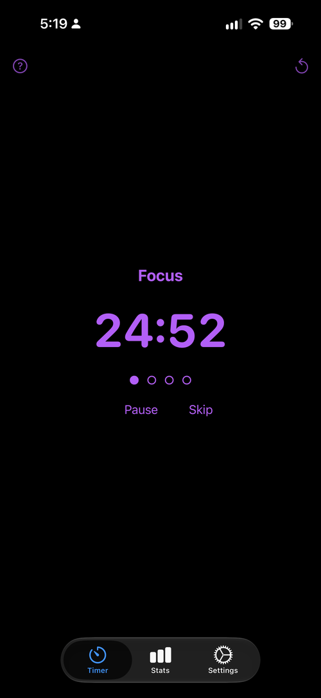
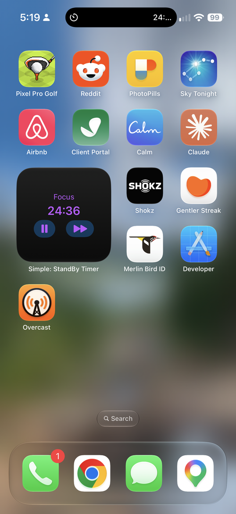
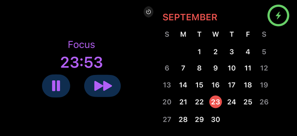
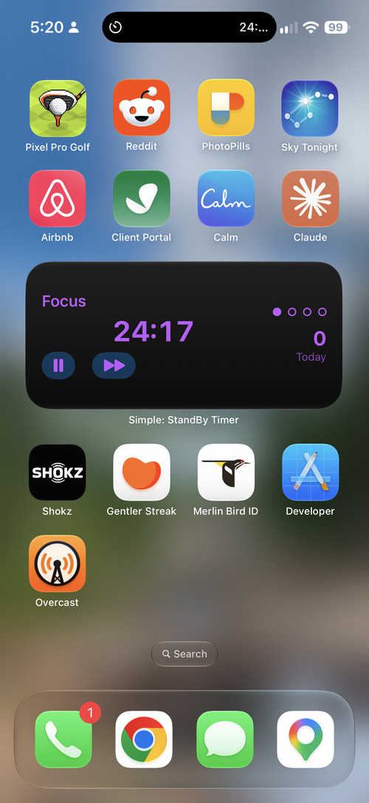
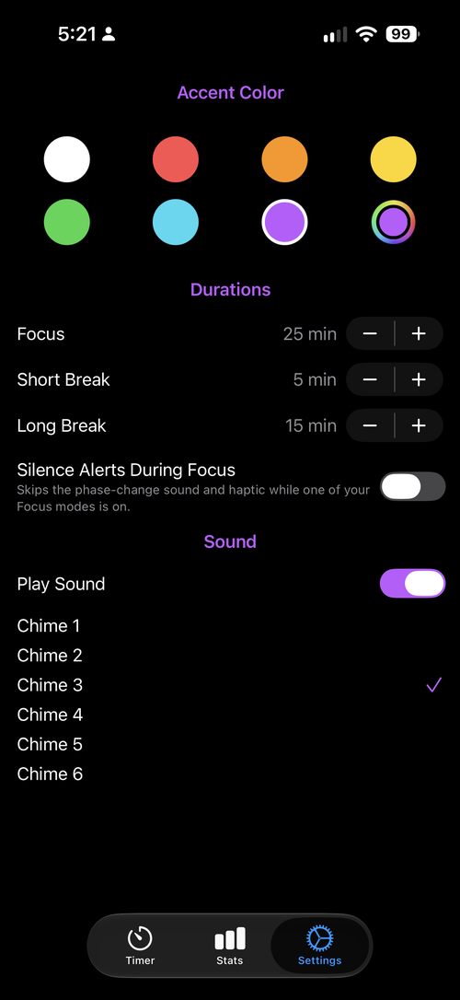

# pomodoro-simple

A Pomodoro timer for iOS designed to sit on your desk or nightstand in
StandBy mode, with the countdown and controls on your Lock Screen and in the
Dynamic Island too. Built as **Simple: StandBy Timer**.

I built this app because I wanted a Pomodoro app I could control from the
StandBy screen, that didn't require a subscription and was simple to use.

> **Availability:** Currently in debugging, with plans to get it into
> TestFlight by September 27, 2026.

## Features

- **StandBy and Dynamic Island.** A running session shows in StandBy and the
  Dynamic Island, so you can check and control the timer without opening the
  app.
- **Live Activities.** The Lock Screen shows a live countdown with
  Pause/Resume/Skip buttons, in your accent color on black.
- **Home Screen and Lock Screen widgets.** Widgets show the current phase and
  countdown, and the Home Screen widgets have Pause/Resume and Skip buttons.
- **Shared state via App Groups.** The app, widgets and Live Activity all
  read and write the same timer state through a shared App Group.
- **Notification permission primer.** On first launch, a screen explains what
  notifications are for before iOS asks for permission.
- **Focus / Short Break / Long Break cycle.** Defaults are 25/5/15 minutes,
  with a Long Break after every 4th Focus session. All three durations can be
  changed in Settings.
- **Stats.** Today's session count, all-time total, current streak, total
  focus time, a last-7-days chart and a per-day history.
- **Accent colors.** Choose from 7 preset colors or pick a custom one with
  the color picker.

## Screenshots

| Timer | Live Activity | StandBy |
| --- | --- | --- |
|  |  |  |

| Widget | Settings |
| --- | --- |
|  |  |

## Tech stack

Swift · SwiftUI · WidgetKit · ActivityKit · App Intents · SwiftData · Swift
Charts · UserNotifications · XcodeGen (project generation) · XCTest

## How I build

Developed with [Claude Code](https://claude.com/claude-code). I gave Claude a
fairly open prompt describing most of the functionality I wanted, then let it
do its thing to see what would or could happen.

## Building it yourself

### One-time setup (before first build)

This repo is already configured with the bundle id `com.aarontilley.pomodoro`
and matching App Group `group.com.aarontilley.pomodoro` — if you're building
this exact repo under that same Apple Developer account, skip straight to
step 4.

If you're forking this for your own Apple Developer account instead, pick
your own reverse-DNS bundle id (e.g. `com.yourname.pomodoro`) and replace
`com.aarontilley.pomodoro` everywhere it appears first:
   - `project.yml` (`bundleIdPrefix`, both `PRODUCT_BUNDLE_IDENTIFIER` values)
   - `Pomodoro/Pomodoro.entitlements` and `PomodoroWidget/PomodoroWidget.entitlements`
     (the `group.com.aarontilley.pomodoro` App Group id — keep the `group.` prefix)
   - `Shared/AppGroup.swift` (`identifier`)

1. Install tools: `brew install xcodegen imagemagick`
2. In [Apple's developer portal](https://developer.apple.com/account/resources/identifiers/list),
   register an App Group with the exact id above, and register it as a
   capability on both the app and widget extension App IDs (or let Xcode's
   "Automatically manage signing" register it for you in step 5 below).
3. Enroll in the paid Apple Developer Program if you haven't already — App
   Groups require it; a free/personal-team account can't use them at all.
4. Run `xcodegen generate`, then open `Pomodoro.xcodeproj` in Xcode.
5. In Xcode, select your Team for both the `Pomodoro` and
   `PomodoroWidgetExtension` targets under Signing & Capabilities, and
   confirm the App Groups capability shows your group id on both targets.
   If building for a physical device for the first time, also register the
   device under your team (Xcode usually offers to do this automatically
   once you pick it as the run destination).

### Testing

Unit tests live in `PomodoroTests/` and run from the `Pomodoro` scheme. The
widget, Live Activity and StandBy visuals can't be unit tested; see the
[manual testing checklist](TESTING.md) and run through it on a real device.
