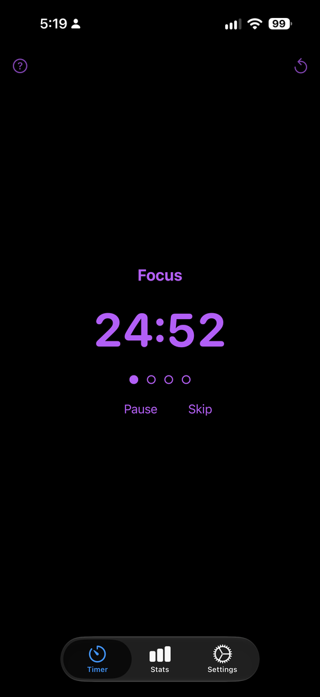
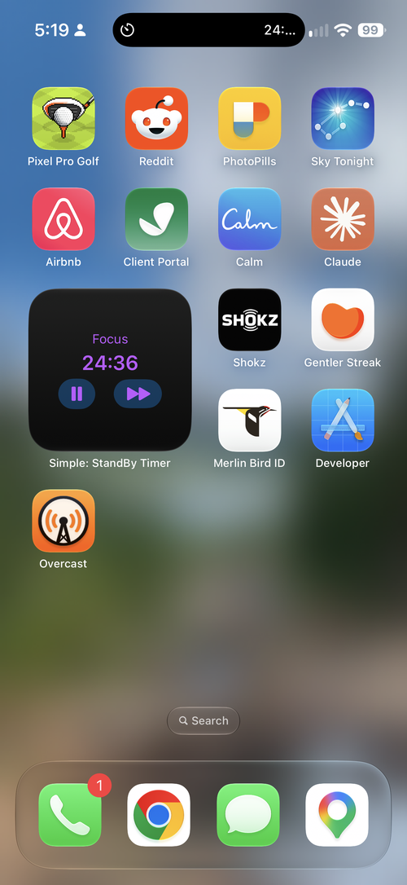
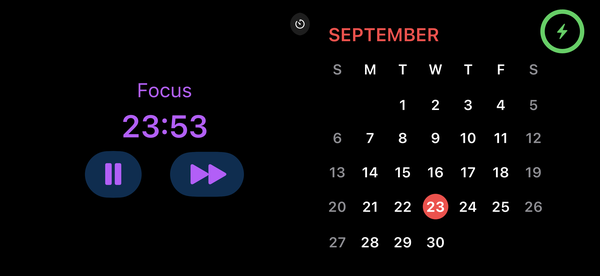
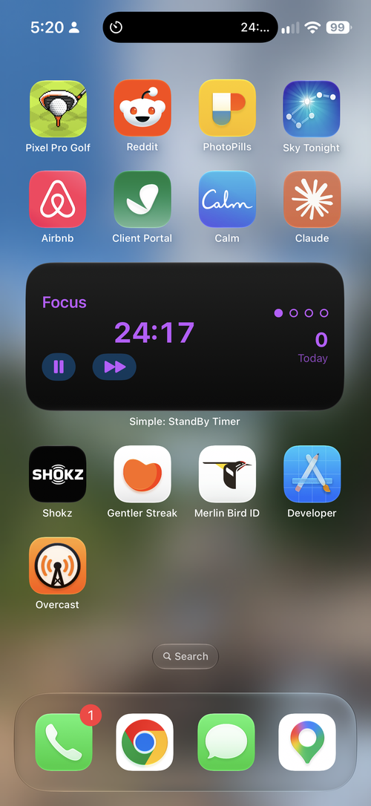
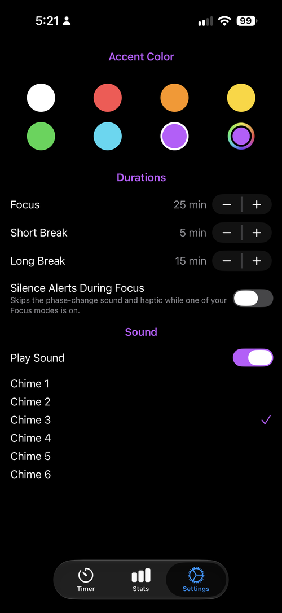

# pomodoro-simple

A Pomodoro timer for iOS designed to sit on your desk or nightstand in
StandBy mode, with the countdown and controls on your Lock Screen and in the
Dynamic Island too. Built as **Simple: StandBy Timer**.

I built this app because I wanted a Pomodoro app I could control from the
StandBy screen, that didn't require a subscription and was simple to use.

> **Availability:** Currently in debugging, with plans to get it into
> TestFlight by September 27, 2026.

## Features

- **StandBy and Dynamic Island.** A running session shows in StandBy and the
  Dynamic Island, so you can check and control the timer without opening the
  app.
- **Live Activities.** The Lock Screen shows a live countdown with
  Pause/Resume/Skip buttons, in your accent color on black.
- **Home Screen and Lock Screen widgets.** Widgets show the current phase and
  countdown, and the Home Screen widgets have Pause/Resume and Skip buttons.
- **Shared state via App Groups.** The app, widgets and Live Activity all
  read and write the same timer state through a shared App Group.
- **Notification permission primer.** On first launch, a screen explains what
  notifications are for before iOS asks for permission.
- **Focus / Short Break / Long Break cycle.** Defaults are 25/5/15 minutes,
  with a Long Break after every 4th Focus session. All three durations can be
  changed in Settings.
- **Stats.** Today's session count, all-time total, current streak, total
  focus time, a last-7-days chart and a per-day history.
- **Accent colors.** Choose from 7 preset colors or pick a custom one with
  the color picker.

## Screenshots

| Timer | Live Activity | StandBy |
| --- | --- | --- |
|  |  |  |

| Widget | Settings |
| --- | --- |
|  |  |

## Tech stack

Swift · SwiftUI · WidgetKit · ActivityKit · App Intents · SwiftData · Swift
Charts · UserNotifications · XcodeGen (project generation) · XCTest

## How I build

Developed with [Claude Code](https://claude.com/claude-code). I gave Claude a
fairly open prompt describing most of the functionality I wanted, then let it
do its thing to see what would or could happen.

## Building it yourself

### One-time setup (before first build)

This repo is already configured with the bundle id `com.aarontilley.pomodoro`
and matching App Group `group.com.aarontilley.pomodoro` — if you're building
this exact repo under that same Apple Developer account, skip straight to
step 4.

If you're forking this for your own Apple Developer account instead, pick
your own reverse-DNS bundle id (e.g. `com.yourname.pomodoro`) and replace
`com.aarontilley.pomodoro` everywhere it appears first:
   - `project.yml` (`bundleIdPrefix`, both `PRODUCT_BUNDLE_IDENTIFIER` values)
   - `Pomodoro/Pomodoro.entitlements` and `PomodoroWidget/PomodoroWidget.entitlements`
     (the `group.com.aarontilley.pomodoro` App Group id — keep the `group.` prefix)
   - `Shared/AppGroup.swift` (`identifier`)

1. Install tools: `brew install xcodegen imagemagick`
2. In [Apple's developer portal](https://developer.apple.com/account/resources/identifiers/list),
   register an App Group with the exact id above, and register it as a
   capability on both the app and widget extension App IDs (or let Xcode's
   "Automatically manage signing" register it for you in step 5 below).
3. Enroll in the paid Apple Developer Program if you haven't already — App
   Groups require it; a free/personal-team account can't use them at all.
4. Run `xcodegen generate`, then open `Pomodoro.xcodeproj` in Xcode.
   `Pomodoro.xcodeproj` is generated and git-ignored, so re-run
   `xcodegen generate` whenever you pull changes that add, remove, or move
   Swift files.
5. In Xcode, select your Team for both the `Pomodoro` and
   `PomodoroWidgetExtension` targets under Signing & Capabilities, and
   confirm the App Groups capability shows your group id on both targets.
   If building for a physical device for the first time, also register the
   device under your team (Xcode usually offers to do this automatically
   once you pick it as the run destination).

## Xcode Cloud

`Pomodoro.xcodeproj` isn't committed, so `ci_scripts/ci_post_clone.sh`
installs XcodeGen and runs `xcodegen generate` right after Xcode Cloud clones
the repo. Xcode Cloud also assigns its own build numbers when it archives, so
the `CFBundleVersion` in the Info.plists only matters for manual uploads from
Xcode's Organizer.

## Manual testing checklist

Widget/Live Activity/StandBy visuals cannot be unit tested — run through this
on a real device (a simulator can approximate StandBy and the Dynamic Island,
but a physical device docked and charging in landscape is the real test):

- [ ] Start a session, background the app, confirm the Live Activity shows on
      the Lock Screen with a live countdown and the chosen accent color on black.
- [ ] Simulator: Features menu → StandBy, confirm landscape rendering.
- [ ] Physical device: dock/charge in landscape, confirm StandBy matches.
- [ ] Tap Pause, then Resume, then Skip from the Lock Screen/StandBy Live
      Activity while the app is backgrounded; reopen the app and confirm its
      UI reflects each change.
- [ ] On a fresh install, confirm the notification primer screen appears
      first, before the Help sheet and before the real system permission
      dialog. Tap "Not Now"; confirm the system dialog never appears and the
      app still runs a full session with foreground sound/haptic only.
- [ ] Delete and reinstall fresh again; this time tap "Enable Notifications"
      on the primer and confirm the real system dialog appears next, then
      deny it there; confirm the app still doesn't crash and runs normally.
- [ ] Toggle each of the 7 preset accent colors in Settings; confirm the Timer
      screen, idle widget, and Live Activity all pick up the new color.
- [ ] Let a work phase's countdown run out with the app foregrounded; confirm
      it auto-advances to a short break and the Stats screen's "Today" count
      increments by one.
- [ ] Add the small round (circular) widget to the Lock Screen and start a
      session: the ring drains in real time with the countdown in the middle,
      with the app closed. Pause: the ring freezes with a pause glyph.
      Pause/resume a few times; the ring still matches the countdown. When
      the phase ends, the ring empties and shows a checkmark.
- [ ] Add the idle widget to the Home Screen and to the Lock Screen; confirm
      tapping either opens the app.
- [ ] From the Home Screen widget, tap Pause/Resume and Skip; confirm they
      respond immediately (no multi-second delay) and the widget updates.
- [ ] With no session running, tap Start on the small and medium Home Screen
      widgets (app closed); confirm a session starts with the active profile,
      the Live Activity appears on the Lock Screen, and opening the app shows
      it running. Tapping Start again right away must not restart it.
- [ ] Tap Skip during Focus: a prompt asks first. Before the halfway mark it
      offers only "Skip Without Counting"; past halfway it also offers
      "Finish & Count It", which moves to the break, fills a cycle dot, and
      adds the session to Stats with the minutes actually focused. Skip
      during a break still skips immediately.
- [ ] Tap Restart mid-session; confirm the confirmation alert appears
      (centered, not a bottom sheet) and accepting it resets to a fresh
      Focus session with the cycle dots back to empty.
- [ ] Delete the app and reinstall fresh; confirm the Help sheet appears
      automatically right after the notification primer is dismissed (either
      choice), and that the "?" icon reopens it afterward without
      auto-showing again.
- [ ] Complete 4 Focus sessions in a row (Skip is fine for this); confirm
      the 4th is followed by a Long Break and the cycle dots reset to empty.
- [ ] On a fresh install with no sessions yet, open the Stats tab and confirm
      it loads (zeros, an empty 7-day chart, and the "Completed Focus sessions
      will show up here" message) without crashing.
- [ ] With the app open, let a *break* run out; confirm it advances to Focus
      once, the chime/haptic plays once (no system notification sound on top),
      and the new Focus countdown actually counts down.
- [ ] Let a Focus session run out with the phone locked, then tap Continue on
      the Lock Screen Live Activity (or dismiss the notification); open the
      app and confirm Stats and the medium widget's "Today" count include it.
- [ ] Start a session, force-quit the app, reopen it mid-phase; confirm the
      countdown is right and the phase still advances on its own at zero.
- [ ] With the Home Screen widget visible, let a phase run out; confirm it
      switches to "Time's up" with a Continue button, and that Continue
      advances exactly one phase.
- [ ] Mid-session, change the accent color (preset and custom picker);
      confirm the Live Activity and widget pick it up within a second or two.
- [ ] Turn Settings → Play Sound off mid-phase, lock the phone, and confirm
      the phase-end notification arrives silently.
- [ ] Updating from a build without profiles: confirm Settings → Timer
      Profiles shows "Classic" with the durations you had set before, plus
      "Deep Work", and that existing Stats history appears under Classic.
- [ ] Add a profile with 2 sessions per cycle; select it on the Timer screen;
      confirm 2 cycle dots and a Long Break after the 2nd Focus session.
- [ ] Start a session and confirm the profile menu can't be changed until
      it's stopped, and that the profile you're using can't be deleted.
- [ ] With 2+ profiles, confirm the Live Activity, widget, and phase-end
      notification read "<Profile> · Focus".
- [ ] Finish sessions under two profiles; confirm Stats → All Profiles shows
      the combined totals plus a By Profile breakdown, and tapping a profile
      (or picking it in "Showing") filters the whole screen to it.
- [ ] Stats → Export History as CSV: share to Files or Mail, open it in
      Numbers/Excel; confirm one row per session (date, time, profile,
      minutes), oldest first, including sessions from a deleted profile. The
      button is hidden when there's no history yet.
- [ ] Delete a profile that has history; confirm its sessions still count in
      the overall stats and it's still selectable under "Showing".
- [ ] Turn on Settings → Keep Screen Awake, start a session, and leave the
      phone on the Timer screen past its Auto-Lock time; confirm it stays on.
      Then confirm it does lock normally after switching to another tab, when no
      session is running, or with the setting off.
- [ ] VoiceOver pass (Settings → Accessibility → VoiceOver, or triple-click
      the side button if set up): swipe through Timer, Stats, and Settings.
      Every control should say what it is ("How it works", "Restart session",
      "Cycle progress, 2 of 4 Focus sessions done", color names), the paused
      time should read as "Paused, 12 minutes, 34 seconds remaining", and
      Stats rows should read as one item each ("Today, 3 sessions").
- [ ] Largest text size (Settings → Accessibility → Display & Text Size →
      Larger Text, max): Timer, Stats, Settings, and the profile editor stay
      usable, and "Resume" isn't cut off.
- [ ] Pick a very dark custom color; confirm Settings shows the
      hard-to-read warning.
### Testing

Unit tests live in `PomodoroTests/` and run from the `Pomodoro` scheme. The
widget, Live Activity and StandBy visuals can't be unit tested; see the
[manual testing checklist](TESTING.md) and run through it on a real device.
